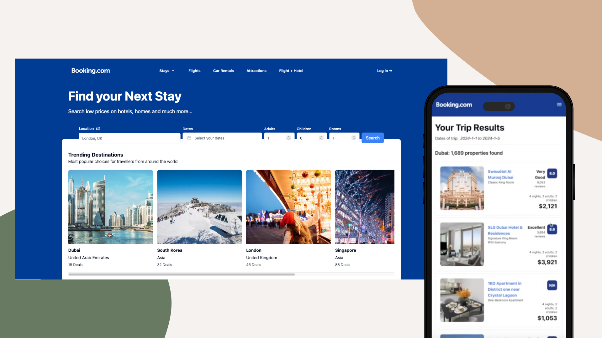

# Clone of Booking.com

Booking.com clone done for learning purposes only. Built with Next.js 14. Scrapes data from the booking.com site using Oxylabs. Among technologies used are Typescript, React, ShadCS (for UI and TW CSS), Zod (for validating forms), Vercel (for deployment), etc.

Screenshot of application:

Live link, [here]()

## Table of Contents

- [Installation](#Installation)
- [Usage](#Usage)
- [Contributing](#Contributing)
- [Tests](#Tests)
- [License](#License)
- [Questions](#Questions)

## Installation

Feel free to clone the repo or reference the code and simply run it in your browser.

## Usage

Great for practicing various web technologies listed in the overview.

## Contributing

If you would like to add anything, please reach out.

## Tests

n/a

## License

This project is released under MIT opensource license:
https://opensource.org/licenses/MIT

## Questions

For more about me or my projects, check out my Github profile: https://github.com/nard1n
